# Azure Help Desk Simulation Lab

## Overview
This project simulates real-world IT support scenarios in **Azure** and **Microsoft 365**, demonstrating troubleshooting steps and resolutions.  
The lab covers common issues such as VM connection failures, storage access permissions, and Microsoft Teams licensing problems.  

## Tools Used
- Azure Portal
- Azure Resource Manager (ARM)
- Network Security Groups (NSG)
- Azure Storage Accounts
- Microsoft 365 Admin Center
- PowerShell (for RDP connectivity test)

## Scenarios Simulated

### 0. Setup Azure Environment
- Create **2 Virtual Machines (Windows/Linux)**.  
- Create **1 Storage Account**.  

**Screenshots:**  
- Azure VMs created  
  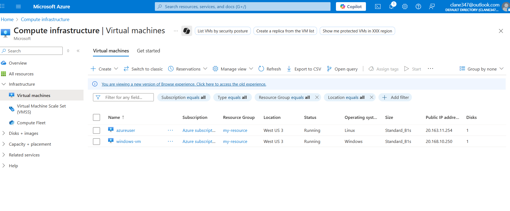  
- Storage Account created  
  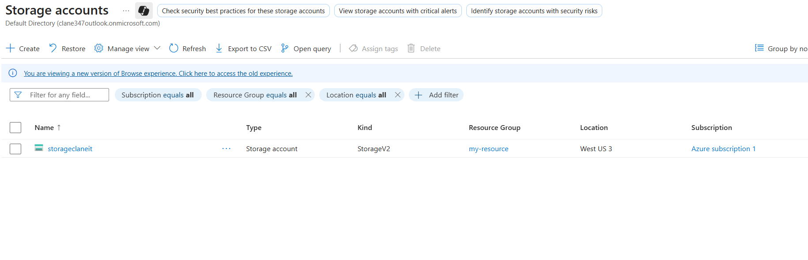  

---

### 1. RDP/SSH Connection Fails
- Blocked RDP (3389) or SSH (22) in **NSG inbound rules**.
- Verified failure using RDP client / SSH and PowerShell command.
- Fixed by adding inbound rule to allow RDP/SSH.

**Screenshots:**  
- Connection failure  
  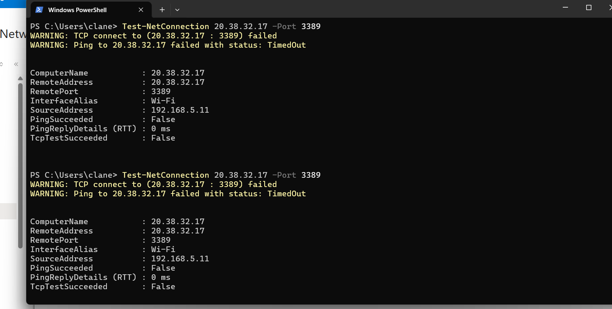  
- NSG rule update  
  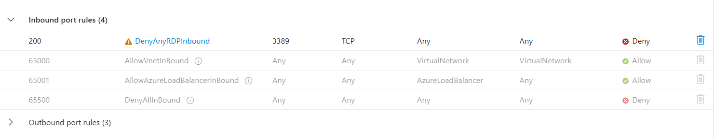  
  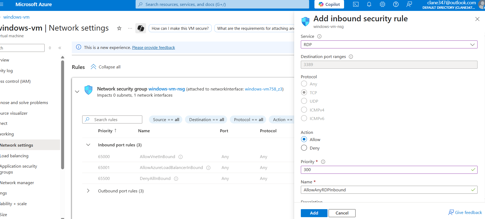  
- Successful login  
  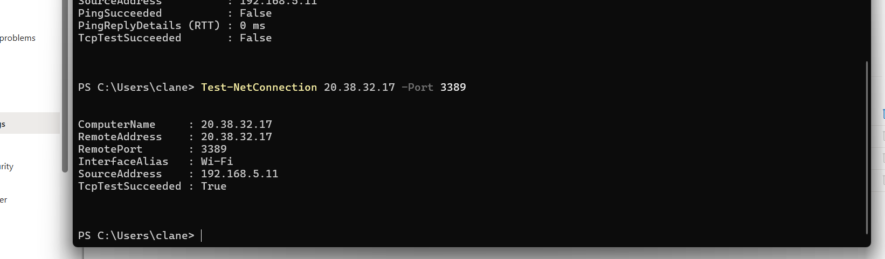  

---

### 2. Storage Account Access Denied
- Created a test user with no assigned Azure role.
- User attempted to access Blob storage → received **access denied**.
- Fixed by assigning **Storage Blob Data Contributor** role.

**Screenshots:**  
- Created new User
  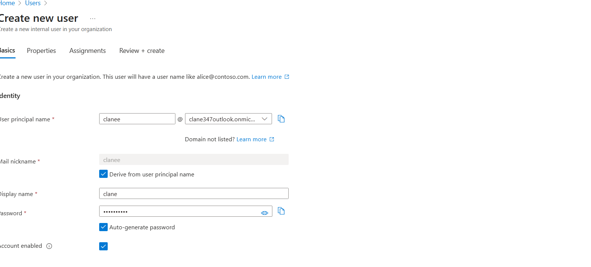 
- Access denied error  
  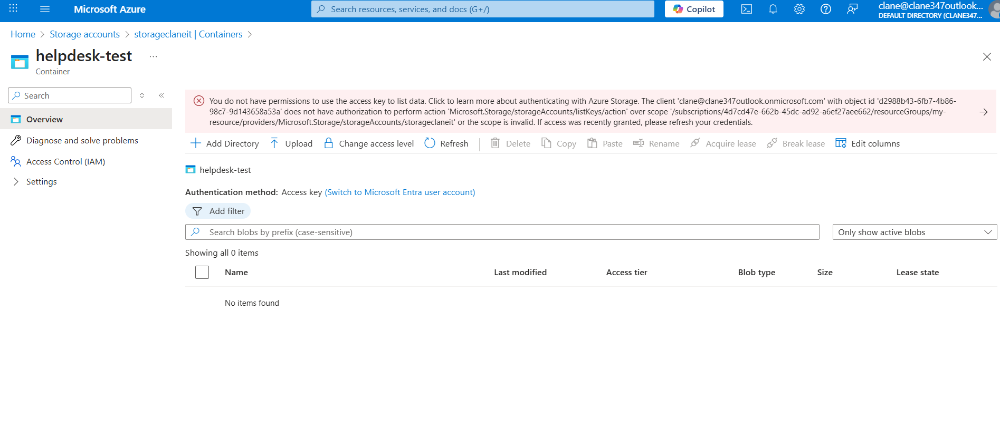  
- IAM role assignment  
  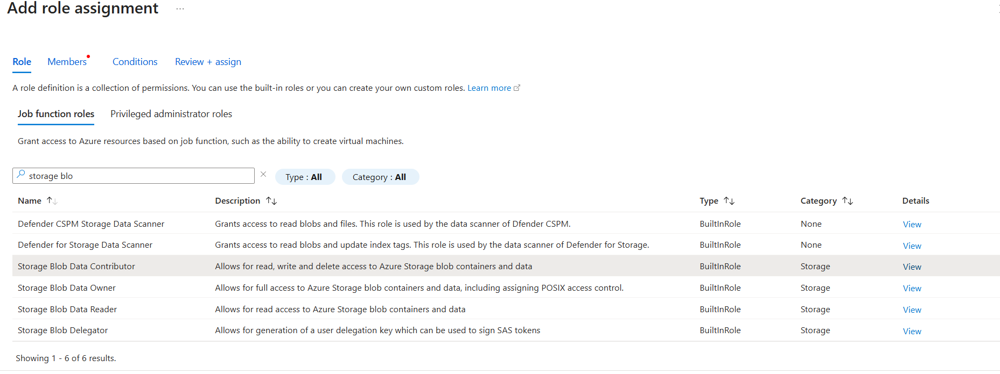  
  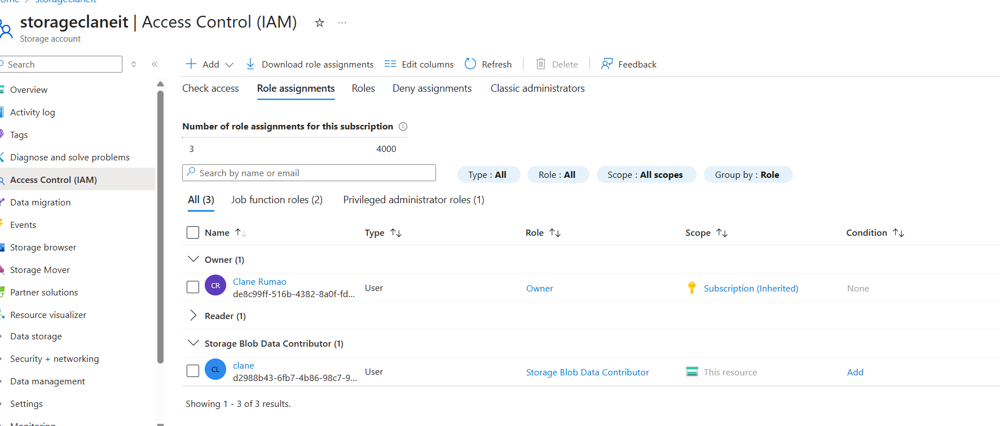  
- Successful file upload/download  
  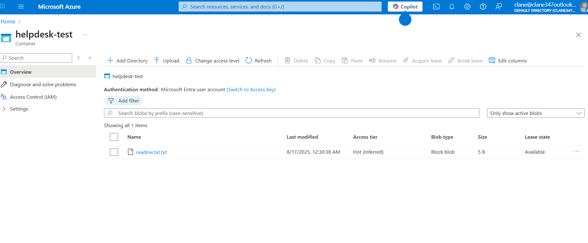  

---

### 3. Microsoft Teams Not Working
- Created a test user in Microsoft 365 with **no license assigned**.
- Tried logging in → received **license error**.
- Fixed by assigning **Microsoft 365 E3 license** in Admin Center.

**Screenshots:**  
- Created Test User
  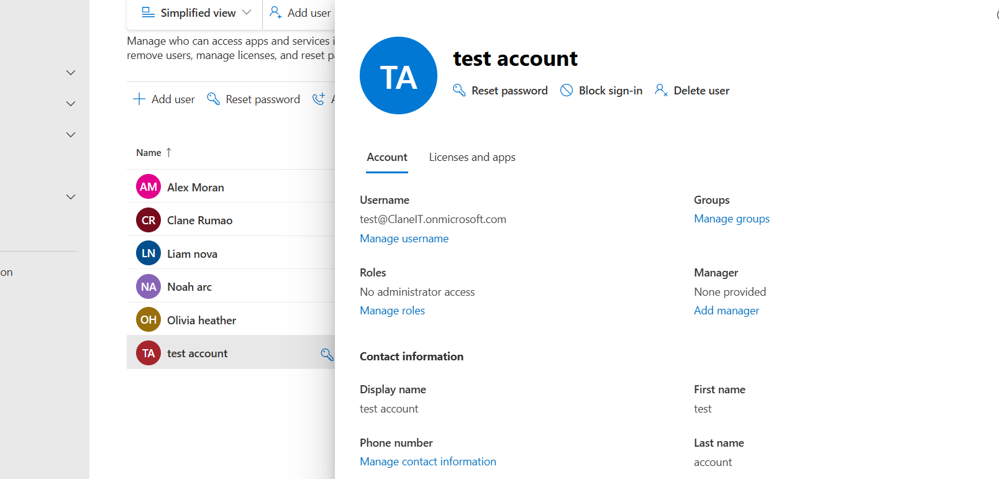 
- Teams login failure  
  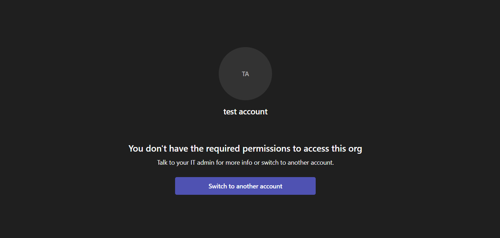  
- Admin license assignment  
  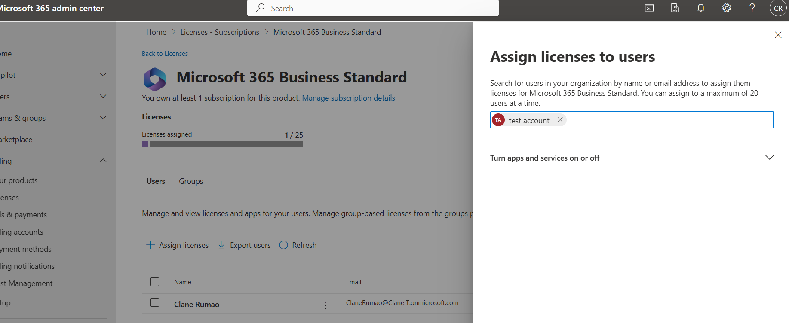 
  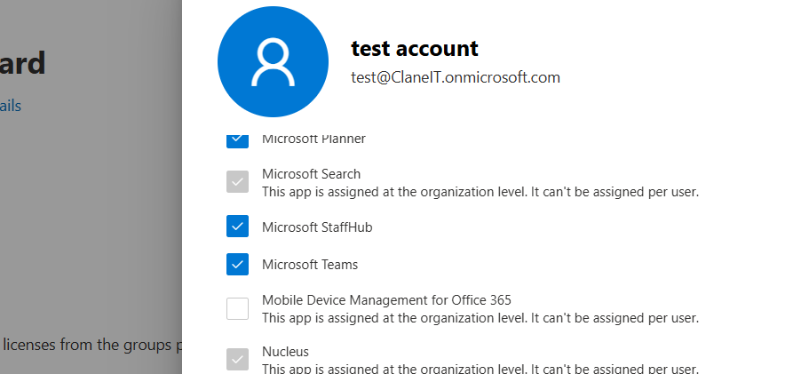  
- Teams working after fix  
  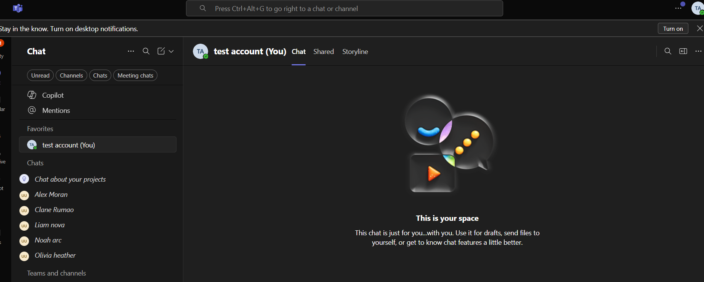  

---

## Lessons Learned
- Importance of NSG inbound rules for connectivity.
- Role-Based Access Control (RBAC) is crucial for resource access.
- Microsoft 365 licenses directly affect app availability.
- Real-world troubleshooting requires both **diagnostics** and **permissions management**.

## Author
**Clane Cyril Rumao**  
Master’s in Computer Science | Cloud & IT Support Enthusiast  
